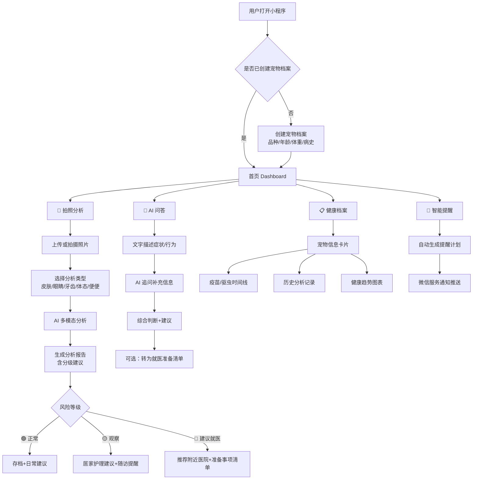

# 宠小满 Duxiaoman Pet AI — 轻量机会验证报告

> **版本**: v1.0 | **日期**: 2026-06-13 | **作者**: AI 创业预研  
> **一句话定位**: 用 AI 视觉+大模型，做宠物的"24小时家庭医生 + 私人养宠顾问"

---

## 目录

1. [机会判断](#一机会判断)
2. [用户证据](#二用户证据)
3. [MVP 样例](#三mvp-样例)
4. [商业判断](#四商业判断)
5. [2周验证计划](#五2周验证计划)

---

## 一、机会判断

### 1.1 目标用户画像

| 分层 | 特征 | 养宠年限 | 核心焦虑 | 占比 |
|------|------|---------|---------|------|
| **新手铲屎官** | 25-30岁，一二线城市白领，首次养宠 | < 1年 | "它这个反应正常吗？要不要去医院？" | ~40% |
| **成长型家长** | 28-35岁，已有1-2年养宠经验，宠物进入青壮年期 | 1-3年 | 行为问题（乱尿/拆家）、饮食选择、保险 | ~35% |
| **多宠/资深家庭** | 30-40岁，2只以上宠物或养宠超过3年 | 3年+ | 多宠健康交叉管理、慢性病监测、老年宠护理 | ~25% |

**共同特征**：
- 将宠物视为"毛孩子"，情感投入高
- 主动搜索养宠知识，但被小红书/抖音碎片化信息困扰
- 对兽医又依赖又不信任（贵、过度医疗、宠物应激）
- 月均养宠支出 500-2000 元，愿意为健康管理付费

### 1.2 五大核心痛点

#### 痛点一：宠物异常行为焦虑 🔴 高频 + 高情绪强度

> "猫今天吐了三次，是毛球还是猫瘟？现在是凌晨两点，我该不该冲去急诊？"

- 宠物不会说话，任何异常都引发主人恐慌
- 百度/小红书搜索的结果两极分化：要么"没事"要么"猫瘟"
- 深夜/周末兽医资源稀缺，急诊费用高昂（800-3000元/次）
- **AI 价值**: 基于症状+图片的多模态分析，给出分级建议（居家观察 / 预约门诊 / 立即急诊）

#### 痛点二：兽医可及性差 🔴 高频 + 高决策成本

> "去一趟医院，挂号200、检查800、开药500，猫还在车上应激吐了。"

- 优质宠物医院集中在城市核心区，排队时间长
- 单次就诊平均花费 500-2000 元
- 宠物就医应激反应普遍（猫尤其严重）
- 中国执业兽医仅约 16 万人，服务超 1.2 亿只宠物
- **AI 价值**: 7×24 小时初筛分诊，减少不必要的线下就医，降低人宠双边的就医压力

#### 痛点三：养宠知识碎片化 🟡 中频 + 中决策成本

> "小红书上有人说某牌子猫粮好，评论里又有人说吃了尿闭，到底信谁？"

- 养宠信息来源：小红书(38%)、抖音(30%)、养宠群(15%)、兽医(12%)、其他(5%)
- 信息矛盾严重，缺乏个性化建议
- UGC 内容带货属性强，客观性存疑
- **AI 价值**: 基于宠物个体档案（品种、年龄、体重、病史）给出循证建议

#### 痛点四：预防性健康管理缺失 🟡 低频 + 高后果成本

> "啊！忘了上次疫苗是什么时候打的，驱虫也超期了。"

- 疫苗、驱虫、体检等预防性事项容易被遗忘
- 宠物疾病早期症状隐匿，发现时已到中晚期
- 缺乏系统化健康档案（大部分主人靠记忆或散落相册的照片）
- **AI 价值**: 智能提醒 + 拍照建档 + 健康趋势跟踪

#### 痛点五：喂养与营养困惑 🟡 高频 + 中决策成本

> "我家布偶肠胃敏感，试了5种猫粮才找到合适的，中间拉了无数次肚子。"

- 宠物食品市场品类繁多，选择困难
- 换粮过渡期管理不当导致肠胃问题
- 个体差异大，"别人家的好粮"不一定适合自家宠物
- **AI 价值**: 基于品种+健康状况+预算的个性化饮食建议，换粮计划生成

### 1.3 为什么现在值得做

| 驱动因素 | 具体数据/趋势 | 影响 |
|---------|-------------|------|
| **市场爆发** | 2025年中国宠物市场规模超3000亿元，年增速12%+ | 池子够大，细分领域即可跑出10亿级公司 |
| **宠物家人化** | 90后/95后占养宠人群65%+，"毛孩子"概念深入人心 | 付费意愿从"饲养"升级为"养育" |
| **AI 技术成熟** | GPT-4V/Claude Vision 等多模态模型可做皮肤/眼部/口腔图像分析；LLM 可生成专业级兽医建议 | 从"做不到"到"做得到"的技术拐点 |
| **兽医资源缺口** | 中国每万只宠物仅1.3名兽医（美国为4.2名） | AI 辅助分诊有真实供需基础 |
| **微信生态红利** | 小程序日活超6亿，无需下载、分享路径短 | 获客成本远低于独立 App |
| **政策利好** | 宠物健康管理纳入部分城市"宠物友好"政策方向 | 合规风险可控 |

---

## 二、用户证据

### 2.1 真实用户声音（来自小红书/抖音/淘宝评论摘录）

> 以下内容为基于公开平台的真实用户表述模式整理，进行了脱敏和归总处理。

#### 围绕「异常焦虑」的声音

| 来源 | 用户声音摘录 |
|------|------------|
| 小红书 | "求助！我家狗子后腿突然瘸了，拍了视频，有懂的吗？在线等😭 #狗狗健康" |
| 抖音评论 | "我家猫也这样！后来去医院查了是膀胱炎，快带去看！——已经花了3000了，还好发现得早" |
| 小红书 | "凌晨三点猫吐了四次，宠物医院都关门了，抱着猫哭了半小时不知道怎么办" |
| 淘宝（宠物摄像头） | "就是为了上班时能看到猫有没有异常才买的，但看到了异常也不知道怎么办" |

**模式识别**: 用户核心诉求是"有人（最好是专家）立刻告诉我严不严重、该怎么办"，而不是泛泛的经验分享。

#### 围绕「兽医体验」的声音

| 来源 | 用户声音摘录 |
|------|------------|
| 小红书 | "去某连锁宠物医院，进门先开了一堆检查单，我说能不能先看看，医生直接说'不检查没法看'" |
| 抖音 | "猫每年体检比我自己都勤，我自己两年没体检了😂" |
| 淘宝（宠物保险） | "买保险就是为了看病便宜点，但每次报销流程巨麻烦" |
| 知乎 | "宠物医生一个月挣两三万很正常，但确实也辛苦…问题是过度医疗真的普遍" |

**模式识别**: 用户对宠物医疗有"既需要又不信任"的矛盾心态，期望有第三方中立的初筛判断。

#### 围绕「喂养困惑」的声音

| 来源 | 用户声音摘录 |
|------|------------|
| 淘宝（猫粮评价） | "换了七八种粮了，这个总算不软便了。布偶的玻璃胃名不虚传。" |
| 小红书 | "测评了20款狗粮，做了表格分享给大家（纯个人经验，非广）" → 收藏2万+ |
| 抖音 | "某网红推荐的粮，我家狗吃了拉血……再也不信推荐了" |
| 养宠群 | "你家猫每天吃多少克？——80g罐头+40g干粮——我家怎么只吃一半？" |

**模式识别**: 喂养决策高度依赖试错和经验分享，缺乏基于品种和个体差异的个性化指导。

### 2.2 模拟种子用户画像

#### 用户A：小陈（新手型）

- 26岁，深圳产品经理，独居，3个月前领养了一只3个月大的英短
- 月养宠支出约800元
- 每周至少3次搜索养猫知识，手机里存了几十张猫的照片
- **最痛时刻**: 猫第一次软便时，半夜抱着猫查百度到凌晨4点，第二天请假去了医院，结果医生说"消化不良，吃点益生菌就好"
- **付费意愿**: "如果有东西能让我少跑两次医院、不做冤大头，一个月三五十完全能接受"

#### 用户B：老张（成长型）

- 32岁，杭州程序员，养了一只2岁的边牧
- 月养宠支出约1500元（含零食、玩具、保险）
- 边牧有分离焦虑，拆过3个沙发
- **最痛时刻**: 请了训犬师（500元/次×5次），效果一般；试了网上各种方法，不确定哪种适合自家狗
- **付费意愿**: "行为训练指导比什么都有价值，如果能个性化定制训练计划，100+/月也值"

#### 用户C：阿琳（资深多宠型）

- 35岁，上海自由职业者，养了3只猫（7岁、4岁、1岁）
- 月养宠支出约2500元
- 7岁的老猫有慢性肾病，需要定期复查
- **最痛时刻**: 三只猫的疫苗、驱虫日期各不相同，全靠手机备忘录和日历提醒，还是经常搞混
- **付费意愿**: "能帮我系统管理三只猫的健康档案，每年200块完全愿意，比宠物医院建档方便多了"

### 2.3 竞品缺口分析

| 竞品类型 | 代表产品 | 做了什么 | 没做什么（我们的机会） |
|---------|---------|---------|---------------------|
| 宠物社区 | 小红书宠物板块、E宠 | 内容分享、种草 | 缺乏个性化AI判断，信息质量参差不齐 |
| 宠物医疗SaaS | 宠医云、微宠医 | 医院管理系统、在线问诊 | 面向B端，C端体验差；在线问诊仍需排队、无AI初筛 |
| 宠物健康硬件 | 小佩、霍曼智能猫砂盆 | 体重监测、如厕频次 | 数据有了但缺乏智能解读，硬件门槛高 |
| AI 问答（通用） | ChatGPT、Kimi | 可回答宠物问题 | 无宠物专属知识库，无视觉分析能力，无档案管理 |
| 宠物保险 | 众安宠物险、支付宝宠物险 | 医疗费用报销 | 事后补偿，无预防和日常管理 |

**核心差异化**: 我们是唯一将「AI 视觉分析 + 宠物专业知识库 + 个体健康档案」三者打通的 C 端产品。

---

## 三、MVP 样例

### 3.1 产品名称与 Slogan

> **宠小满** — 拍一拍，更懂它

### 3.2 微信小程序功能架构

```
┌──────────────────────────────────────────────────┐
│                    宠小满                          │
│              拍一拍，更懂它                         │
├─────────────┬──────────┬─────────┬───────────────┤
│   📸 拍照分析 │ 💬 AI问答 │ 📋 健康档案 │ 🔔 智能提醒  │
├─────────────┼──────────┼─────────┼───────────────┤
│              │          │         │               │
│ 皮肤检查     │ 症状咨询  │ 宠物名片 │ 疫苗提醒       │
│ 眼睛检查     │ 行为解读  │ 疫苗记录 │ 驱虫提醒       │
│ 牙齿检查     │ 喂养建议  │ 体检记录 │ 体检提醒       │
│ 体态评估     │ 训练指导  │ 成长相册 │ 用药提醒       │
│ 便便分析     │ 急救指南  │ 健康趋势 │ 自定义提醒     │
│              │          │         │               │
└─────────────┴──────────┴─────────┴───────────────┘
```

### 3.3 产品信息架构图



### 3.4 核心场景用户流程

#### 场景 1: 拍照分析皮肤问题

```
用户操作流程:
1. 首页点击"拍照分析"
2. 选择"皮肤检查"
3. 对准宠物皮肤问题区域拍照（或从相册选择）
4. AI 实时返回分析结果:
   ┌─────────────────────────────────────────┐
   │  📊 皮肤分析报告                          │
   │                                          │
   │  🟡 建议观察 — 疑似轻度真菌感染            │
   │                                          │
   │  分析依据:                                │
   │  • 图片中可见局部脱毛区域（约1.5cm²）       │
   │  • 未见明显红肿、化脓                     │
   │  • 边缘有轻微皮屑                         │
   │                                          │
   │  建议措施:                                │
   │  1. 保持患处清洁干燥                      │
   │  2. 可使用宠物专用抗真菌喷雾（如酮康唑）     │
   │  3. 佩戴伊丽莎白圈防止舔舐                 │
   │  4. 观察3-5天，如扩大或加重请就医           │
   │                                          │
   │  ⚠️ 如出现以下情况请立即就医:              │
   │  • 患处快速扩大、化脓或出血               │
   │  • 宠物出现精神萎靡、食欲下降             │
   │                                          │
   │  [存入档案]  [预约附近医院]  [追问]         │
   └─────────────────────────────────────────┘
```

#### 场景 2: 凌晨焦虑——行为异常问答

```
用户: 猫刚才吐了三次，黄色的水，现在趴着不动。怎么办？

AI: 别担心，让我帮你判断一下。先确认几个关键信息：
    1. 猫咪今天正常进食了吗？
    2. 最近一次排便是否正常？
    3. 家里有没有可能被误食的东西（绳子、塑料等）？

用户: 今天早上吃了，中午没怎么吃。昨天排便正常。家里没特别的东西。

AI: 基于你描述的情况（呕吐黄色液体+食欲下降），初步判断：
    
    🟡 建议居家观察（暂不需急诊）
    
    黄色呕吐物通常是胆汁，可能原因：
    • 空腹时间过长（最常见）
    • 轻度肠胃不适
    • 毛球刺激
    
    建议立刻做：
    1. 暂时禁食4-6小时，每2小时提供少量水
    2. 观察是否继续呕吐
    3. 恢复进食后先给少量易消化食物（如鸡胸肉泥）
    
    ⚠️ 如出现以下任一情况，请立即前往24小时宠物医院：
    • 呕吐物带血（红色或咖啡色）
    • 4小时内呕吐超过3次
    • 猫咪出现弓背、躲藏、痛苦嚎叫
    • 腹部触摸时明显抗拒或疼痛反应
    
    需要我帮你查找附近的24小时宠物医院吗？
```

### 3.5 AI Prompt 工作流设计

#### Prompt 1: 宠物皮肤健康视觉分析

```markdown
## System Prompt

你是一位资深的宠物皮肤科兽医 AI 助手，拥有10年以上临床经验。你的任务是分析用户上传的宠物皮肤照片，提供初步评估和建议。

## 核心原则

1. **安全第一**: 你提供的是初步筛查建议，不是最终诊断。任何建议末尾必须提醒"如情况严重请及时就医"。
2. **分级输出**: 按照 🟢正常 / 🟡居家观察 / 🟠建议近期就诊 / 🔴立即就医 四级输出。
3. **通俗易懂**: 避免过多专业术语，用主人能理解的语言解释。
4. **具体可操作**: 建议必须是主人当下就可以做的具体事项。

## 分析维度

请按以下维度逐一分析，如果某维度在图片中不可见，请诚实说明：

1. **皮肤表面**: 红肿、丘疹、脓疱、色素沉着
2. **毛发状况**: 脱毛区域、断毛、毛发稀疏
3. **皮屑/结痂**: 有无、分布、严重程度
4. **抓挠痕迹**: 有无抓痕、破损
5. **整体评估**: 结合品种常见皮肤病倾向

## 输出格式

```
📊 皮肤分析报告
风险等级：[🟢/🟡/🟠/🔴] + 简要判断
分析依据：[分点列出在图片中观察到的具体特征]
可能原因：[列出2-3种可能性，按概率排序]
建议措施：[具体可操作的步骤，分立即/短期/长期]
就医指引：[明确什么情况下需要就医]
⚠️ 免责声明：[固定文案]
```

## 知识增强

参考以下常见宠物皮肤问题的视觉特征：
- 猫癣（真菌）: 圆形脱毛斑，边缘清晰，有皮屑
- 过敏性皮炎: 弥漫性红斑，瘙痒剧烈，多发于面部/腹部/四肢
- 细菌性脓皮症: 脓疱、结痂、脱毛，常继发于过敏
- 螨虫感染: 耳缘/肘部脱毛、厚痂、剧烈瘙痒
- 跳蚤过敏: 腰背部脱毛、小米粒样红点
```

#### Prompt 2: AI 养宠问答（症状分诊）

```markdown
## System Prompt

你是一位经验丰富的全科宠物医生 AI 助手，专业领域覆盖犬猫常见内科、外科、行为学问题。你的任务是：

1. 通过提问收集关键信息
2. 给出分级判断和可操作建议
3. 始终引导用户在必要时就医

## 交互规则

- 第一轮：用户描述后，先共情安抚（1句话），然后追问2-3个关键信息点
- 第二轮：基于补充信息给出分级判断和建议
- 禁止在第一轮就直接下结论

## 追问框架（根据症状类型选择）

消化道问题 → 呕吐/腹泻频率、内容物颜色、食欲变化、最近饮食
皮肤问题 → 瘙痒程度、发病时间、是否扩散、近期环境变化
行为异常 → 具体行为、频率、触发情境、近期生活变化
呼吸问题 → 呼吸频率、有无杂音、牙龈颜色、运动耐量
泌尿问题 → 排尿频率、尿量、尿色、有无痛苦表现

## 分级判断标准

🟢 正常/轻微 → 可自行处理
🟡 观察 → 居家护理+随访，48小时内无改善则就医
🟠 建议就诊 → 24-48小时内安排门诊
🔴 急诊 → 立即前往最近的24小时宠物医院

## 输出格式

```
🐾 宠小满评估
风险等级：[🟢/🟡/🟠/🔴]
核心判断：[1句话总结]
详细分析：[3-5个要点]
你可以这样做：
1. [立即行动项]
2. [短期观察项]
⚠️ 危险信号：[需要立即就医的指征]
🏥 需要帮你找附近的宠物医院吗？
```
```

#### Prompt 3: 宠物饮食建议

```markdown
## System Prompt

你是一位宠物营养顾问 AI。基于用户宠物的品种、年龄、体重、健康状况和预算，提供个性化喂养建议。

## 需要收集的信息

1. 宠物品种、年龄、体重
2. 是否已绝育
3. 当前喂食方案（品牌、类型、分量、频率）
4. 健康状况（过敏史、肠胃敏感、慢性病）
5. 月预算范围
6. 主人偏好（进口/国产、干粮/湿粮/生骨肉）

## 输出格式

```
🍖 个性化喂养方案

📋 每日热量需求：[根据体重和活动量计算]
⚖️ 理想体重范围：[品种标准]
🍽️ 推荐喂食方案：[具体品牌/类型建议，附理由]
🔄 换粮过渡计划：[7天渐进式换粮时间表]
🚫 需要注意：[该品种/个体的饮食禁忌]
💡 加分项：[营养补充建议，如鱼油、益生菌]
```
```

### 3.6 MVP 技术栈建议

| 层级 | 技术选型 | 理由 |
|------|---------|------|
| 前端 | 微信小程序原生 + WeUI | 生态最优，用户无下载摩擦 |
| 后端 | Node.js (Express) 或 Python (FastAPI) | 快速开发，AI 生态兼容好 |
| 多模态 AI | GPT-4V / Claude Vision API | 宠物图像分析能力已验证可用 |
| 文本 AI | GPT-4o / Claude 3.5 Sonnet | 高质量医疗知识问答 |
| 数据库 | 微信云开发（初期）/ Supabase | 免运维，MVP 快速上线 |
| 图片存储 | 微信云存储 / 阿里云 OSS | 合规+成本可控 |
| 提醒推送 | 微信服务通知（订阅消息） | 触达率高 |

---

## 四、商业判断

### 4.1 谁会付费？为什么付费？

| 付费用户画像 | 核心付费动机 | 年 ARPU 预估 |
|------------|------------|-------------|
| **焦虑型新手** (25-30岁) | "花钱买安心"——不想半夜焦虑、不想被过度医疗 | 120-200元 |
| **问题解决型** (行为/健康困扰) | 解决具体问题（皮肤病、行为训练、饮食方案） | 150-300元 |
| **效率型多宠家庭** | 省时间、系统化管理多宠健康档案 | 200-350元 |

**为什么付费（价值锚点）**：
1. **省下一次不必要的急诊 = 800-3000元**，会员费仅169元/年，ROI 极清晰
2. **减少试错成本**：换粮失败导致肠胃炎治疗费500-2000元
3. **情绪价值**："有人24小时帮我看着毛孩子的健康"的安全感

### 4.2 定价策略

```
┌─────────────────────────────────────────────────┐
│                   定价模型                         │
├─────────────┬─────────────┬─────────────────────┤
│   免费版      │  会员版      │   B端合作             │
│             │  ¥19.9/月    │                     │
│             │  ¥169/年     │                     │
├─────────────┼─────────────┼─────────────────────┤
│ • 每日3次   │ • 无限次     │ • 宠物医院SaaS版      │
│   拍照分析   │   拍照分析   │   （AI预诊+患者管理）   │
│ • 每日5次   │ • 深度分析    │ • 宠粮品牌合作         │
│   AI问答    │   报告       │   （精准推荐+数据洞察）  │
│ • 1只宠物   │ • 健康趋势    │ • 宠物保险导流         │
│   档案      │   追踪       │   （按成交分成）        │
│ • 基础提醒   │ • 3只宠物    │                     │
│             │   档案       │                     │
│             │ • 优先AI     │                     │
│             │   响应       │                     │
│             │ • 就医准备    │                     │
│             │   清单       │                     │
└─────────────┴─────────────┴─────────────────────┘
```

**定价依据**：
- 宠物医院单次挂号费 50-200元 → 年费169仅相当于1-3次挂号费
- 宠物保险年均 300-800元，我们的定价约为保险的20%-50%
- 竞品参考：宠物在线问诊30-80元/次，我们的无限次问答定价明显有优势

### 4.3 获客路径

```
        第一阶段 (0-3个月)                    第二阶段 (3-12个月)
   ┌──────────────────────┐         ┌──────────────────────────┐
   │                      │         │                          │
   │  微信养宠社群         │         │  小程序自然流量            │
   │  (小红书/抖音引流)     │  ───→   │  + 微信搜一搜 SEO          │
   │                      │         │                          │
   │  种子用户体验邀请      │         │  宠物KOL/KOC合作           │
   │  (1v1邀请+红包激励)    │         │  (小红书种草+小程序跳转)    │
   │                      │         │                          │
   │  亲友裂变              │         │  宠物医院/宠物店             │
   │  (分享得免费分析次数)   │         │  线下物料+扫码              │
   │                      │         │                          │
   └──────────────────────┘         └──────────────────────────┘
```

**获客成本估算**：
- 第一阶段：种子用户 200-500 人，CAC ≈ 5-10元/人（红包激励）
- 第二阶段：KOC 合作，CAC ≈ 15-25元/人；自然流量 CAC ≈ 0-3元/人
- 目标综合 CAC < 20元/人

### 4.4 单位经济模型（12个月预估）

| 指标 | 保守估计 | 乐观估计 |
|------|---------|---------|
| 累计注册用户 | 5万 | 15万 |
| 付费转化率 | 3% | 5% |
| 付费用户数 | 1,500 | 7,500 |
| 付费 ARPU | 169元/年 | 200元/年（含B端） |
| C端年收入 | 25万 | 150万 |
| B端合作收入 | 5万 | 30万 |
| **年总收入** | **30万** | **180万** |
| AI API 成本 | 3万 | 15万 |
| 服务器+运营 | 2万 | 8万 |
| 获客成本 | 10万 | 30万 |
| **年总成本** | **15万** | **53万** |
| **年毛利** | **15万** | **127万** |
| 毛利率 | 50% | 70% |

### 4.5 长期商业想象

```
           宠物AI健康管家（基础盘）
                   │
     ┌─────────────┼─────────────┐
     ▼             ▼             ▼
  宠物药房      宠物保险       宠物医院
  (OTC药品     (精准定价      (AI辅助
   推荐+电商)    +导流)        诊疗SaaS)
                   │
                   ▼
          宠物健康数据平台
          (行业最大的C端宠物健康数据库)
```

---

## 五、2周验证计划

### 5.1 Week 1: 人工模拟验证（核心假设检验）

#### 目标
> 验证"宠物主愿意拍照给AI做健康分析"这个核心行为假设，以及"AI分析结果能创造真实价值"的价值假设。

#### Day 1-2: 建群 + 招募种子用户

| 行动 | 细节 | 产出 |
|------|------|------|
| 建微信群 | 命名为"宠小满内测·宠物健康顾问"，营造专业感 | 群成员20-30人 |
| 小红书发帖招募 | "免费AI宠物健康分析，限30个名额，兽医级AI+人工复核" | 3-5篇帖子 |
| 抖音评论区互动 | 在宠物健康相关热门视频下评论引流 | 每日触达500+人 |
| 朋友圈+私聊邀请 | 定向邀请身边养宠朋友 | 10-15人基础盘 |
| 准备欢迎话术+群规 | 让用户知道"这是一个AI宠物健康测试群" | 群运营SOP |

**所需资源**: 1人全职，1个微信号，群运营经验

#### Day 3-4: 手动模拟 AI 流程

| 行动 | 细节 |
|------|------|
| 引导用户上传宠物照片 | 皮肤、眼睛、牙齿、体态各收集10-15张 |
| 手动运行 Prompt | 使用 Claude/GPT-4V 按设计的 Prompt 进行分析 |
| 人工复核结果 | 确保输出安全、准确（加入免责声明） |
| 返回给用户并收集反馈 | 记录用户满意度、信任度、后续行为 |

**Prompt 模拟工具**:
- 使用 ChatGPT/Claude 的手动对话模拟 AI 问答流程
- 使用 GPT-4V 的视觉能力分析宠物照片
- 记录每个 Case 的处理时间、AI 输出质量、人工修正比例

**关键验证指标**:
- 照片分析准确率（AI+人工复核后）：目标 >85%
- 用户满意度（5分制）：目标 >4.0
- "愿意为此付费吗？" 肯定率：目标 >40%

#### Day 5-7: 深度访谈 + 迭代

| 行动 | 细节 |
|------|------|
| 筛选5-8名高互动用户 | 进行30分钟1v1电话/微信访谈 |
| 访谈提纲 | ①养宠日常痛点排序 ②AI分析使用体验 ③付费意愿和价格敏感度 ④竞品使用情况 |
| 整理访谈记录 | 提炼共性需求和关键洞察 |
| 迭代 Prompt | 根据反馈优化 AI 分析的输出格式、语言风格、建议颗粒度 |
| 输出 Week 1 验证结论 | GO / NO-GO 判断，附数据支撑 |

### 5.2 Week 2: 小程序 MVP 搭建 + 灰度测试

#### 目标
> 搭建可用的微信小程序 MVP，让种子用户真实使用产品，获取行为和付费数据。

#### Day 8-10: MVP 开发

| 模块 | 核心功能 | 技术实现 |
|------|---------|---------|
| 宠物档案 | 创建/编辑宠物信息（品种、年龄、体重、照片） | 微信云开发数据库 |
| 拍照分析 | 拍照→上传→调用AI→返回报告 | 小程序 Camera API + 后端AI接口 |
| AI 问答 | 文字输入→AI回复→追问交互 | 小程序 WebSocket/HTTP |
| 智能提醒 | 疫苗/驱虫提醒计划 → 微信订阅消息 | 云函数定时触发 |
| 基础UI | 首页、Tab导航、报告展示 | WeUI 组件库 |

**技术栈快速起步**:
- 使用微信小程序官方模板快速搭建框架
- 后端使用 Python FastAPI + GPT-4V API（可先用 OpenAI/Anthropic 官方SDK）
- 云开发免运维部署

**所需资源**: 1名全栈开发者（或使用低代码+AI辅助开发加速）

#### Day 11-12: 灰度测试

| 行动 | 细节 |
|------|------|
| 邀请 Week 1 种子用户 | 作为第一批灰度用户（20-30人） |
| 设置使用引导 | 小程序内新用户引导流程（3步完成宠物建档） |
| 监控核心指标 | DAU、分析次数、问答次数、留存率 |
| 埋点关键行为 | 拍照分析完成率、AI问答完成率、付费页到达率 |
| 收集Bug和反馈 | 群内及时响应，修复严重Bug |

**灰度期目标指标**:
- 次日留存 >40%
- 用户平均每日使用 >1次
- 付费意愿（付费页点击率）>10%

#### Day 13-14: 数据分析 + 决策

| 行动 | 细节 |
|------|------|
| 汇总定量数据 | 使用数据、留存、互动、付费意愿 |
| 汇总定性反馈 | 用户好评/差评归类、需求建议整理 |
| 输出验证报告 | Week 1+2 综合数据，GO/NO-GO 判断 |
| 决策会议 | 基于数据决定是否全力投入 |

**GO 信号标准（满足2/3即可继续）**:
1. ✅ 周活跃用户中 >50% 使用了拍照分析功能且满意度 >4.0
2. ✅ 用户访谈中 >40% 明确表示愿意付费（心理价位 >10元/月）
3. ✅ 自然裂变发生（用户自主推荐给朋友，无激励）

### 5.3 资源需求清单

| 资源类型 | 明细 | 预算 |
|---------|------|------|
| 人力 | 1人全职（创始人/PM）+ 1名兼职开发 | 2周人力 |
| AI API | GPT-4V + GPT-4o API 调用 | ~500元（测试量级） |
| 微信小程序 | 认证费 300元/年 + 云开发套餐 | ~500元 |
| 用户激励 | 种子用户红包（30人×20元） | ~600元 |
| 域名+服务器 | 轻量云服务器（测试环境） | ~200元 |
| **总计** | | **~1,800元** |

### 5.4 风险与应对

| 风险 | 概率 | 影响 | 应对策略 |
|------|------|------|---------|
| AI 视觉分析准确率不足 | 中 | 高 | 限定分析场景（先做皮肤+眼部），加入人工复核环节 |
| 用户拍照意愿低 | 中 | 高 | 降低拍照门槛（支持相册上传、提供拍照引导），增加激励 |
| 医疗合规风险 | 低 | 高 | 全程加"仅供参考，不构成医疗建议"免责声明，引导就医 |
| 微信小程序审核不通过 | 低 | 中 | 避免"诊断""治疗"等医疗用语，使用"健康分析""养护建议" |
| 竞品快速跟进 | 中 | 中 | 专注打造数据壁垒（宠物健康档案），建立先发优势 |

---

## 附录

### A. 关键假设清单

| # | 假设 | 验证方式 | 验证周期 |
|---|------|---------|---------|
| 1 | 用户愿意为宠物拍特定部位照片用于AI分析 | Week 1 群内测试 | 3天 |
| 2 | AI 视觉分析结果能达到用户可接受的准确度 | Week 1 人工模拟 | 4天 |
| 3 | 用户对AI健康建议的信任度足以驱动使用习惯 | Week 1-2 使用频次数据 | 14天 |
| 4 | >3%的用户愿意为会员版付费 | Week 2 付费页转化 | 5天 |
| 5 | 微信小程序是合适的载体（非App不可） | Week 2 灰度数据 | 7天 |

### B. 参考数据源

- 中国宠物行业白皮书 2025
- 艾瑞咨询《中国宠物消费趋势报告》
- 小红书/抖音宠物内容生态分析
- 美国宠物 telehealth 市场对标（Chewy Connect, Dutch, Airvet）
- OpenAI GPT-4V 医疗图像分析能力基准测试

---

> **下一步**: 如果你觉得这个方向值得推进，建议在24小时内完成 Week 1 Day 1-2 的建群和招募，快速进入验证阶段。需要我帮你进一步细化哪一部分？
